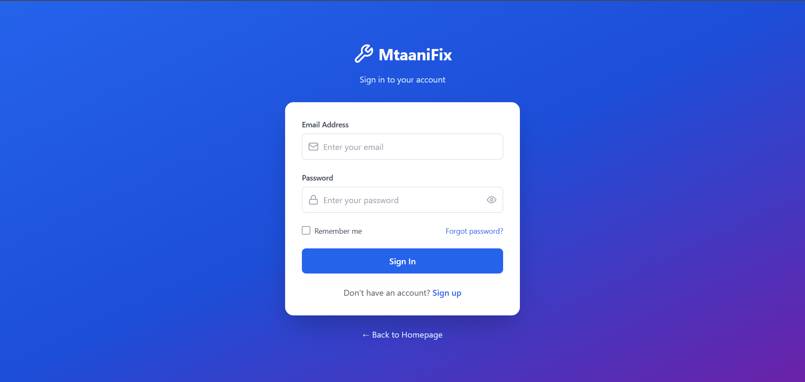

# 🛠️ MtaaniFix — AI-Powered WhatsApp Bot for Booking Skilled Workers

## Overview

**MtaaniFix -** is an AI-powered WhatsApp assistant that connects users with verified sikked workers known as *`fundis`* across Kenya. 
- Whether it's a plumbing emergency, electrical issue, vehicle trouble, or tech support need, MtaaniFix helps you book trusted experts directly through a chat interface.

This project uses **Supabase** as the backend to handle real-time data storage, user management, and authentication.

## 🚀 Features

- 🤖 **AI Chatbot Experience** – Simulates WhatsApp-style conversation with natural responses.
- 📍 **Location-Based Matching** – Smart fundi suggestions based on area and service type.
- ✅ **Verified Professionals** – All service providers are pre-vetted and rated.
- ⚡ **One-Click Booking** – Seamless booking directly in chat.
- 🧠 **Supabase Integration** – Real-time database for managing fundi data, bookings and users.
<!-- - 📱 **Mobile-Friendly UI** – Built using React + Tailwind CSS for responsive design. -->

## 🧠 How It Works

1. User types a request like:  
   `"I need a plumber in Kilimani"`
2. Bot searches Supabase database for verified fundis.

3. Bot responds with:
    `"Found verified plumbers nearby! - (As a list). Shall I book?"`

4. On confirmation, booking data is stored in Supabase and confirmation is displayed.

### Live link
> Live link:   [Mtaani-Fix](https://mtaani-fix.netlify.app/)
 

## 🖼️ Screenshots

> These images represent the user interface of MtaaniFix.

### Landing Page

### 🤖 WhatApp Bot

### 🔐 Login Page

### 🔐 Register Page

### Admin dashboard

### Admin dashboard - Fundis

### Admin dashboard - Bot 

### Admin dashboard - Eaarnings

---

## Tech Stack

| Technology     | Description                                    |
|----------------|------------------------------------------------|
| **React.js**   | Frontend library for building UI               |
| **Tailwind CSS** | Utility-first CSS framework                   |
| **TypeScript** | Typed superset of JavaScript for robustness   |
| **Supabase**   | Backend-as-a-Service (PostgreSQL, Auth, Realtime DB) |
| **Lucide React** | Icon library                                 |
| **React Router** | Client-side routing                          |

---

## Supabase Setup

> Make sure you’ve already created a Supabase project on https://supabase.com/

1. **Create a new project** in Supabase
2. Create tables:
    - `fundis`: for storing service provider info
    - `bookings`: for tracking user bookings
    - `users`: for storing registered user info
3. Enable **Row Level Security (RLS)** and set policies
4. Connect to your Supabase project using environment variables

## Future Enhancements
<!-- - Mobile App -->
- ✅ Integrate WhatsApp API
- 💳 Add mobile payment system (M-Pesa)
- 📊 Admin dashboard for fundis and customers
- 🔔 Push/SMS notifications for booking updates
- 🧾 Receipt and billing automation

## 📞 Contact
- Author: Eric Nzyoka
- Email: nzyoka90@gmail.com
- GitHub: @nzyoka10
